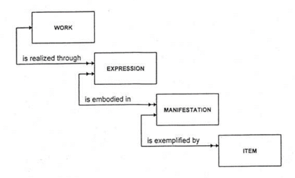
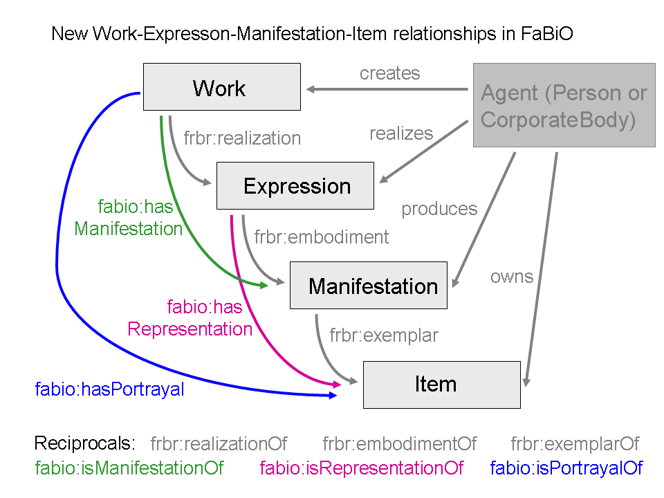
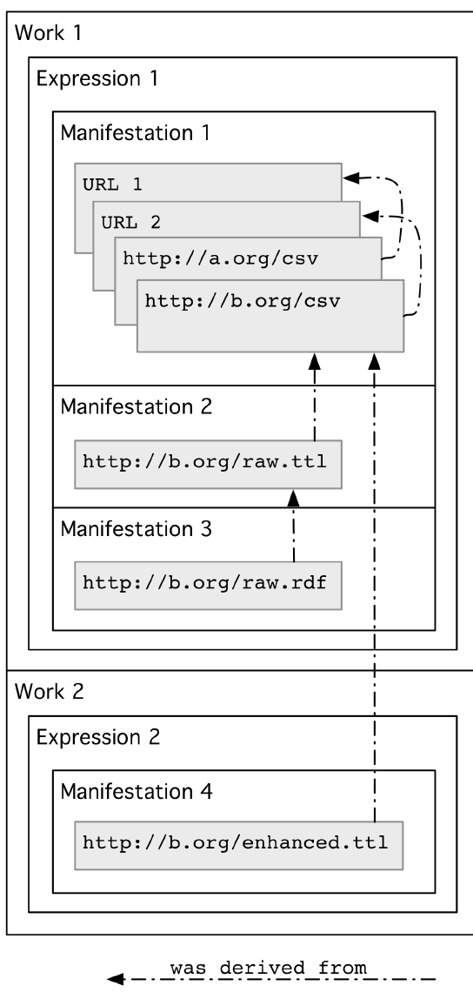
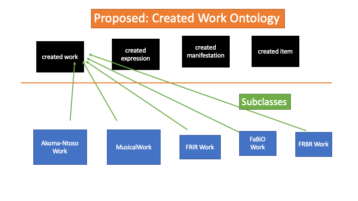

# The Created Work

Karen Coyle kcoyle@kcoyle.net
Lightning talk given at SWIB2019

The Functional Requirements for Bibliographic Records (FRBR) model for the bibliographic entries in library catalogs was developed in 1998. It included a view of creative endeavors having four levels of abstraction: work, expression, manifestation, item (WEMI). These range from the abstract (work) to the concrete (item).

This model, developed solely within and for the library community, has found adherents among metadata practitioners in other communities. These non-library communities present significantly different use cases  both among themselves and against the library use case the model was designed to address. There is evidence that a set of classes that expresses this model but that is not constrained by the library catalog use case would be an appropriate starting point for the development of metadata describing created works in general.

Examples of non-library uses include:

## FaBiO - the FRBR-aligned Bibliographic Ontology

FaBiO (https://sparontologies.github.io/fabio/current/fabio.html) defines its Work class as: "A subclass of FRBR work, restricted to works that are published or potentially publishable, and that contain or are referred to by bibliographic references, or entities used to define bibliographic references." Similar subclasses are created for expression, manifestation and item, and relationships are defined between them beyond those defined in the IFLA FRBR vocabulary. It uses as a basis for FRBR the FRBR Core ontology. (https://vocab.org/frbr/core) 

## FRIR, for "information resources"

FRIR proposes the use of the entities WEMI to organize datasets that have a common ancestor. The relationships between the datasets that define their position in the WEMI structure can be determined through the application of mathematical models that evidence derivation of datasets. 

## Akoma-Ntoso – an XML schema for legal documentation

This [XML schema](http://www.akomantoso.org/ ) incorporates the WEMI structure to describe versions of legal and legislative documents. It defines its own elements for WEMI that are specific to the legal documentation need.

## Music Ontology

The [Music Ontology](http://musicontology.com/) is metadata for publishing music online. Music ontology's MusicalWork is subclassed to FRBR Core Work and is to be used only with musical creations. 

## Proposed: Created Works Ontology

Each of these uses of the concepts originated in FRBR use (or imply) subclassing to FRBR entities. However, they often include vocabulary rules that are not compliant with those of the IFLA-defined objects. Therefore, a more generalized group of classes representing WEMI that uses minimal semantics would allow subclassing for specific needs that are not appropriate as subclasses of the library community's FRBR. In fact, the library FRBR (now [Library Reference Model](https://www.ifla.org/publications/node/11412) would also be potentially a subclass of this more generalized ontology.

